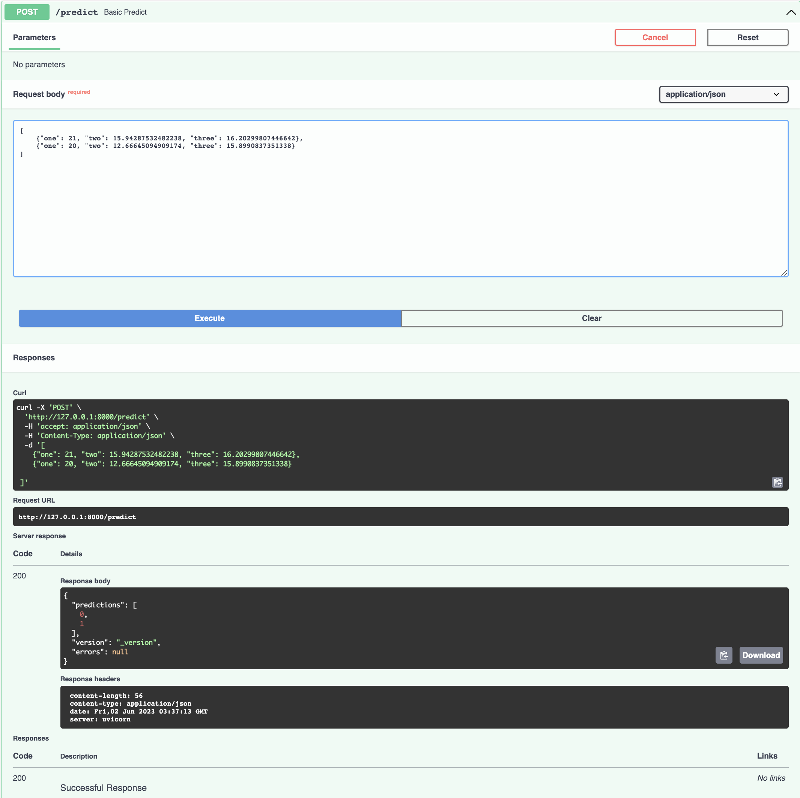

# Machine Learning System Architecture


## Table of Contents
* [General Info](#general-information)
* [Technologies Used](#technologies-used)
* [Features](#features)
* [Setup](#setup)
* [Usage](#usage)
* [Project Status](#project-status)
* [Room for Improvement](#room-for-improvement)
* [Literature of ML System Architecture](#literature-of-ml-system-architecture)


## General Information
- The ML deployment pipeline is that is responsible for the deployment of the ML model to production.
- This project is intended to be used as a template for the deployment of ML models to production.
- While the example project is a simple anomaly detection model, the template can be used for any ML model.


## Technologies Used
- Scikit Learn - version 1.2.2
- Pandas - version 1.3.3
- FastAPI - version 0.68.1
- Terraform - version 1.0.8
- Docker - version 20.10.8
- AWS - version 2.2.12
- Pytest - version 6.2.5


## Features


- Data Infrastructure as Code
- Data Processing
- Model Training
- Model Optimization
- Model Evaluation
- Model Deployment


## Setup
Install the requirements/dependencies listed requirements.txt


## Usage
How does one go about using it?

Provide various use cases and code examples here.

````python
import logging
import pandas as pd
import uvicorn
from fastapi import FastAPI

from container.model_package import anomaly_model

amb = anomaly_model.AnomalyModel()

# Instantiating FastAPI
app = FastAPI()

@app.get("/")
async def root():
    return {"message": "Hello Bigger AI/ML Applications!"}

@app.on_event("startup")
def load_model():
    classifier = "anomaly_model.AnomalyModel()"
    logging.info("Model loaded.")
    return classifier

@app.post("/predict")
async def basic_predict(input_data: list[dict]):

    # Converting dict to pandas dataframe
    input_df = pd.DataFrame(input_data)

    # Getting the prediction
    pred = amb.predict(input_df)

    return pred
````

### Run it

Run the server with:

<div class="termy">

```console
$ uuvicorn container.api.app:app --reload

INFO:     Uvicorn running on http://127.0.0.1:8000 (Press CTRL+C to quit)
INFO:     Started reloader process [28720]
INFO:     Started server process [28722]
INFO:     Waiting for application startup.
INFO:     Application startup complete.
```

</div>


### Prediction Example
Open your browser at <a href="http://127.0.0.1:8000/docs" class="external-link" target="_blank">http://127.0.0.1:8000/docs.


With an input of:
```JSON
{"one": 20, "two": 12.66645094909174, "three": 15.8990837351338}
```

You will see the JSON response as:
```json
{
  "predictions": [
    1
  ],
  "version": "_version",
  "errors": null
}
```
- The prediction is 1, which means that the data point is an anomaly.


### Interactive API docs

Now go to <a href="http://127.0.0.1:8000/docs" class="external-link" target="_blank">http://127.0.0.1:8000/docs

You will see the automatic interactive API documentation (provided by <a href="https://github.com/swagger-api/swagger-ui" class="external-link" target="_blank">Swagger UI</a>):


## Project Status
Project is: _in progress_


## Room for Improvement
Room for improvement:
- The API should be able to handle multiple requests at the same time
- The test coverage should be improved
- The interface for module training and evaluation the model should be improved
- Drift detection should be implemented

To do:
- Fully update the requirements.txt file for easy installation of the project
- Finalize the data pipeline connections for the cloud deployment
- Finalize the model deployment to the cloud
- Integrate CI/CD pipeline for the model deployment
- Finalize the model monitoring and retraining pipeline
- Integrate the model monitoring and retraining pipeline to the CI/CD pipeline

## Literature of ML System Architecture
* [The ML Test Score: A Rubric for ML Production Readiness and Technical Debt Reduction (Google)](https://static.googleusercontent.com/media/research.google.com/en//pubs/archive/aad9f93b86b7addfea4c419b9100c6cdd26cacea.pdf)
* [Software Engineering for Machine Learning: A Case Study (Microsoft)](https://www.microsoft.com/en-us/research/publication/software-engineering-for-machine-learning-a-case-study/)
* [Machine Learning: The High Interest Credit Card of Technical Debt (Google)](https://static.googleusercontent.com/media/research.google.com/en//pubs/archive/43146.pdf)
* [Hidden Technical Debt in Machine Learning Systems (Google)](https://papers.nips.cc/paper/5656-hidden-technical-debt-in-machine-learning-systems.pdf)
* [Software Architecture for ML-based Systems: What Exists and What Lies Ahead (University of L’Aquila)](https://arxiv.org/pdf/2103.07950.pdf)
* [Overcoming Software Architecture Challenges for ML-Enabled Systems (Carnegie Mellon University)](https://apps.dtic.mil/sti/pdfs/AD1150241.pdf)
