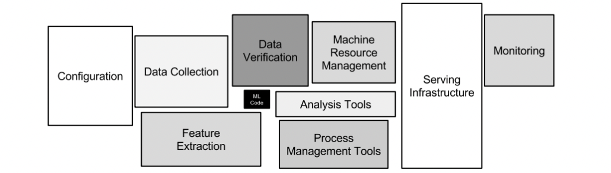
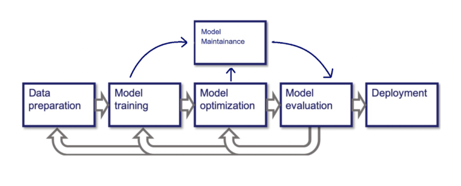

# AnomalyDetectBot

## Machine Learning System Architecture

## The System's Components

### Terraform
* Terraform is an open-source infrastructure as code software tool that provides a consistent CLI workflow to manage hundreds of cloud services.

### SageMaker
* Amazon SageMaker is a fully managed service that provides every developer and data scientist with the ability to build, train, and deploy machine learning (ML) models quickly.

### FastAPI
* FastAPI is a modern, fast (high-performance), web framework for building APIs with Python 3.6+ based on standard Python type hints.

### Docker
* Docker is a set of platform as a service (PaaS) products that use OS-level virtualization to deliver software in packages called containers.

### ML Deployment Pipeline

* The ML deployment pipeline is a CI/CD pipeline that is responsible for the deployment of the ML model to production. The pipeline is triggered by a commit to the ML model repository. The pipeline is responsible for the following steps:
    * Build the ML model Docker image.
    * Push the ML model Docker image to the ECR.
    * Deploy the ML model to the SageMaker.

## Training & Deployment

## Literature of ML System Architecture
* [The ML Test Score: A Rubric for ML Production Readiness and Technical Debt Reduction (Google)](https://static.googleusercontent.com/media/research.google.com/en//pubs/archive/aad9f93b86b7addfea4c419b9100c6cdd26cacea.pdf)
* [Software Engineering for Machine Learning: A Case Study (Microsoft)](https://www.microsoft.com/en-us/research/publication/software-engineering-for-machine-learning-a-case-study/)
* [Machine Learning: The High Interest Credit Card of Technical Debt (Google)](https://static.googleusercontent.com/media/research.google.com/en//pubs/archive/43146.pdf)
* [Hidden Technical Debt in Machine Learning Systems (Google)](https://papers.nips.cc/paper/5656-hidden-technical-debt-in-machine-learning-systems.pdf)
* [Software Architecture for ML-based Systems: What Exists and What Lies Ahead (University of L’Aquila)](https://arxiv.org/pdf/2103.07950.pdf)
* [Overcoming Software Architecture Challenges for ML-Enabled Systems (Carnegie Mellon University)](https://apps.dtic.mil/sti/pdfs/AD1150241.pdf)
